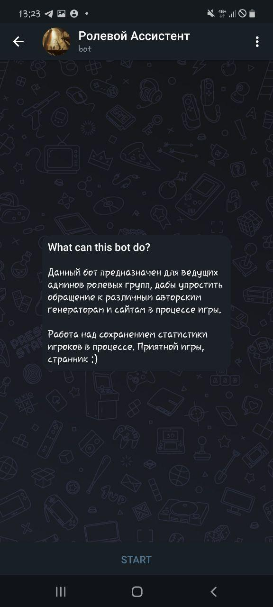
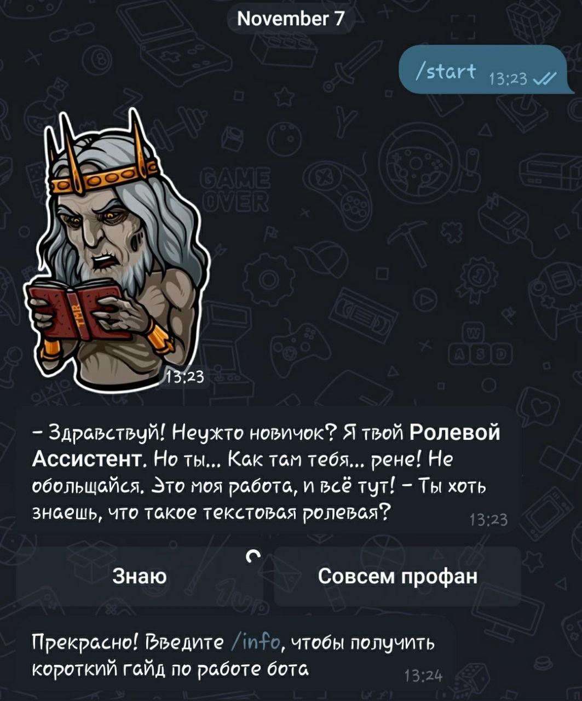
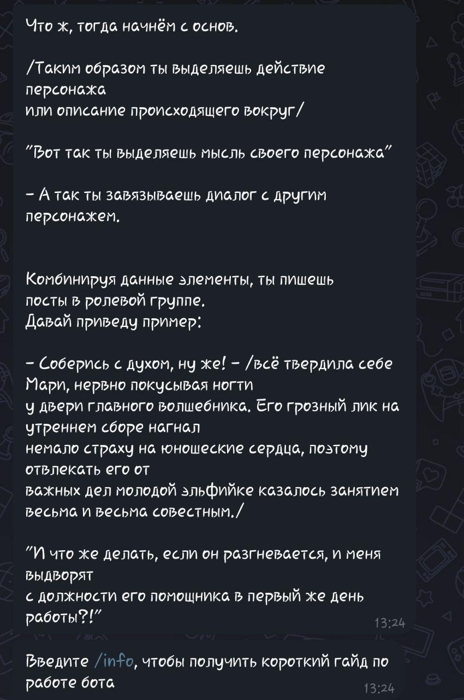
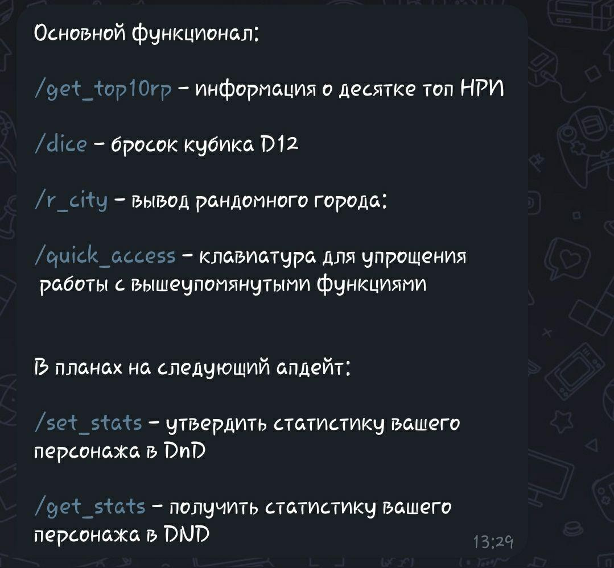
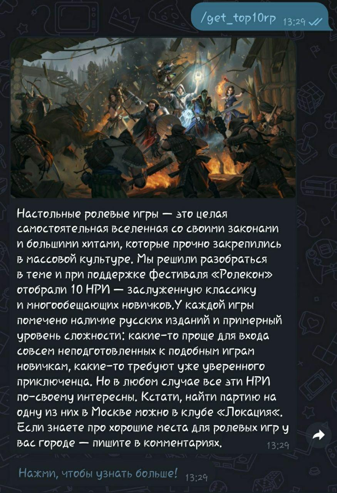
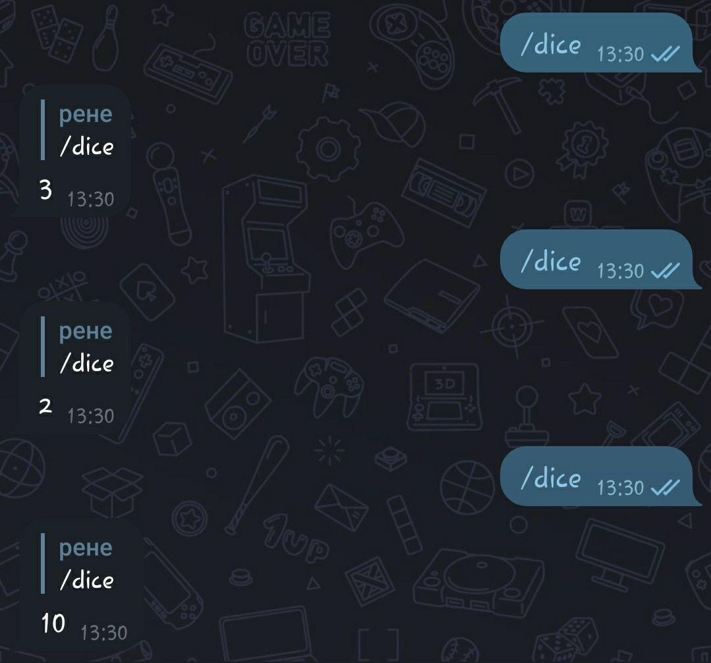
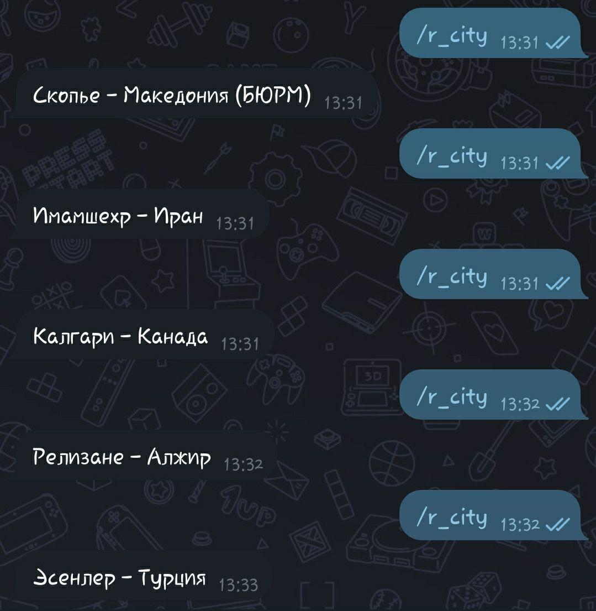

#####Libraries used:  
Requests;  
Beautiful Soup;  
telebot.  

#####What does this Bot offer  
This Bot can be used by role-playing communities that need help in managing the game online through text.
It includes a little intro into the main rules of writing, dice and a basic city generator, as well as it provides a link to the TOP 10 RP Board games.
  
Starts of by the default command - '/start'  
  
  
If a person already knows how to play in text, they can skip the intro-part and head right to the basic functions  
  
  
Otherwise, he is first introduced to the simplest mechanics in game  
  
  
By typing the command '/info' you get four basic funcitons of the Bot and information about the soonest updates I would like to implement after a month or so  
  
  
Here goes an intro from <a href="https://geekster.ru/top10/top-7-nastolnyh-rolevyh-igr/">Geekster.ru</a> and the hyperlink to the page itself:  
  
  
Basic /dice and /r_city functions: first provides you a random value from 1 to 12 as the D12 would in real life, second - location you and your friends would like to play in in the next round.  
  
  
  
This one [/quick_access] provides you a keyboard to easily access both main functions.
  
  
That's all for now, although I aim to work on settings for /dice function - changing it from D12 to D16, for example - and saving statistics of each player specifically for DnD gameplay.
