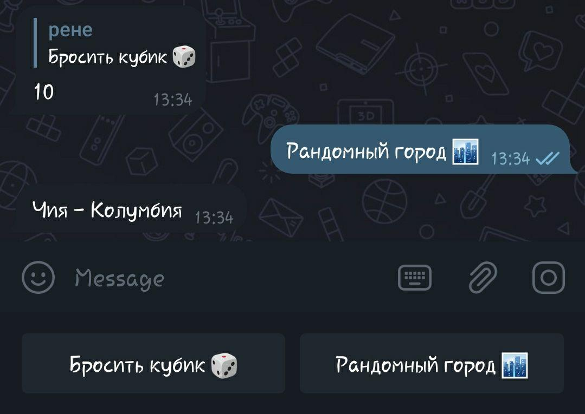

Libraries used:
Requests;
Beautiful Soup;
telebot.

This Bot can be used by role-playing communities that need help in managing the game online through text.
It includes a little intro into the main rules of writing, dice and a basic city generator, as well as it provides a link to the TOP 10 RP Board games.

Starts of by the default command - '/start'

